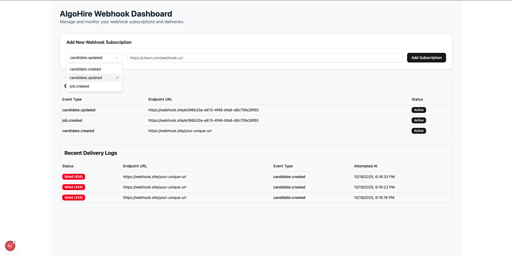

# AlgoHire Webhook Event Relay System

This project is a full-stack, scalable, and reliable webhook relay system built for the AlgoHire recruitment platform. It acts as a centralized gateway to receive events from internal services, process them asynchronously, and deliver them securely to subscribed external client systems (e.g., HRMS, CRM).

A real-time management dashboard enables admins to configure webhooks, monitor deliveries, and ensure operational observability.

## 🖥️ Dashboard Preview




## 🚀 Key Features

-   **Asynchronous Event Processing**: Uses a Redis-based queue (BullMQ) to process events without blocking the main API.
-   **Guaranteed Delivery with Retries**: Automatic retry with exponential backoff for failed webhook deliveries.
-   **Secure by Design**:
    -   **HMAC Signatures**: Each outgoing webhook is signed with a secret key for authenticity.
    -   **API Key Authentication**: Protects dashboard endpoints from unauthorized access.
-   **Real-Time Monitoring Dashboard**: Next.js frontend updates every 5 seconds for live monitoring.
-   **Performance Optimized**: Redis caching reduces database load under heavy traffic.
-   **Containerized Setup**: Managed via Docker Compose for consistent setup and deployment.

## 🧱 Architecture Overview

| Component              | Description                                                  |
| ---------------------- | ------------------------------------------------------------ |
| **Frontend (Next.js)** | Admin dashboard for managing subscriptions and viewing delivery logs |
| **Backend API (Express.js)** | Receives events, manages subscriptions, and serves data to the frontend |
| **Worker Service**     | Consumes jobs from Redis and handles webhook dispatch        |
| **PostgreSQL**         | Persists events, subscriptions, and delivery logs            |
| **Redis**              | Acts as cache and message broker (BullMQ)                    |
| **Migrator**           | Runs DB migrations automatically on startup                  |

## 🧩 Technology Stack

-   **Backend**: Node.js, Express.js, BullMQ
-   **Frontend**: Next.js, React, TypeScript, Tailwind CSS, ShadCN UI
-   **Database**: PostgreSQL
-   **Cache/Queue**: Redis
-   **Containerization**: Docker & Docker Compose
-   **Libraries**: `axios`, `pg`, `ioredis`, `cors`

## ⚙️ Setup & Installation

### Prerequisites

-   Docker
-   Docker Compose

### Run the Application

1.  Clone the repository:
    ```bash
    git clone https://github.com/niteshjangid29/algohire-project.git
    cd algohire-webhook-relay
    ```
2.  Build and run the services:
    ```bash
    docker-compose up --build
    ```
3.  Access the application:
    -   **Frontend Dashboard** → `http://localhost:3000`
    -   **Backend API** → `http://localhost:8000`

## 📂 Folder Structure

```
algohire-webhook-relay/
├── frontend/                  # Next.js dashboard
├── backend/                   # Express API for events & subscriptions
├── /backend/worker/           # BullMQ worker for async webhook dispatch
├── /backend/migrator/         # Auto-run DB migrations
├── docker-compose.yml
└── README.md
```

## 🔄 Data Flow

1.  **Receipt**: Internal service sends event → `POST /api/events`
2.  **Storage**: Event saved in PostgreSQL (`events` table)
3.  **Queueing**: Job added to Redis (BullMQ)
4.  **Processing**: Worker service dispatches webhook
5.  **Logging**: Result recorded in `delivery_logs`
6.  **Dashboard**: Admin views logs in real time

## 🔐 Security

### Outgoing Webhooks (HMAC)

Each webhook request includes an `X-AlgoHire-Signature` header. Clients can verify authenticity by regenerating the hash using their secret key and comparing signatures.

### Dashboard API (API Key)

All management routes (subscriptions, logs) require an `X-API-Key` header for access control.

## 🧰 API Reference with Examples

### 1. Send an Event

**Endpoint**: `POST /api/events`

Triggers a new event to be queued for webhook delivery.

**Example Request**:

```bash
curl --location 'http://localhost:8000/api/events' \
--header 'Content-Type: application/json' \
--data '{
  "eventType": "candidate.created",
  "payload": {
    "candidateId": "cnd_abc123",
    "name": "Jane Doe",
    "status": "Screening"
  }
}'
```

**Example Response**:

```json
{
  "status": "success",
  "message": "Event received and queued for processing.",
  "eventId": "5b2b73a3-19bf-4bfb-9a20-e59f52887f22"
}
```

### 2. Create a Webhook Subscription

**Endpoint**: `POST /api/subscriptions`

Registers an external endpoint for receiving a specific event type.

**Example Request**:

```bash
curl --location 'http://localhost:8000/api/subscriptions' \
--header 'Content-Type: application/json' \
--header 'X-API-Key: fdsakhfdsjkhfewur202387fhdihweio3928' \
--data '{
  "eventType": "candidate.created",
  "endpointUrl": "https://webhook.site/your-unique-url"
}'
```

**Example Response**:

```json
{
  "id": "1043ccb5-7e58-4530-a50a-dc52d1d30707",
  "event_type": "candidate.created",
  "endpoint_url": "https://webhook.site/your-unique-url",
  "is_active": true,
  "created_at": "2025-10-19T12:41:15.392Z"
}
```

### 3. List All Subscriptions

**Endpoint**: `GET /api/subscriptions`

Returns all active webhook subscriptions.

**Example Request**:

```bash
curl --location 'http://localhost:8000/api/subscriptions' \
--header 'X-API-Key: fdsakhfdsjkhfewur202387fhdihweio3928'
```

**Example Response**:

```json
[
  {
    "id": "1043ccb5-7e58-4530-a50a-dc52d1d30707",
    "event_type": "candidate.created",
    "endpoint_url": "https://webhook.site/your-unique-url",
    "is_active": true
  }
]
```

### 4. Fetch Webhook Delivery Logs

**Endpoint**: `GET /api/logs`

Retrieve delivery attempts and their status.

**Example Request**:

```bash
curl --location 'http://localhost:8000/api/logs' \
--header 'X-API-Key: fdsakhfdsjkhfewur202387fhdihweio3928'
```

**Example Response**:

```json
[
  {
    "id": "35df74a2-d9ee-41df-b023-9e190c6ae272",
    "status": "failed",
    "response_status_code": 404,
    "attempted_at": "2025-10-19T12:46:33.082Z",
    "endpoint_url": "https://webhook.site/your-unique-url",
    "event_type": "candidate.created"
  },
  {
    "id": "4ba3fe71-9218-4da0-9bb8-1a14a19f48f7",
    "status": "failed",
    "response_status_code": 404,
    "attempted_at": "2025-10-19T12:46:22.397Z",
    "endpoint_url": "https://webhook.site/your-unique-url",
    "event_type": "candidate.created"
  },
  {
    "id": "6127551b-234e-4047-8001-96ea53b844d3",
    "status": "failed",
    "response_status_code": 404,
    "attempted_at": "2025-10-19T12:46:16.763Z",
    "endpoint_url": "https://webhook.site/your-unique-url",
    "event_type": "candidate.created"
  }
]
```

## 📊 Frontend Dashboard

-   **Auto-refresh**: Fetches new data every 5 seconds.
-   **Views**: Subscriptions, delivery logs, event status.
-   **Admin-only Access**: API key required for all dashboard data requests.

## 🔮 Future Improvements

-   User authentication for dashboard
-   Advanced log filtering & search
-   Manual retry for failed webhooks from UI
-   Auto-deactivation after multiple consecutive failures
